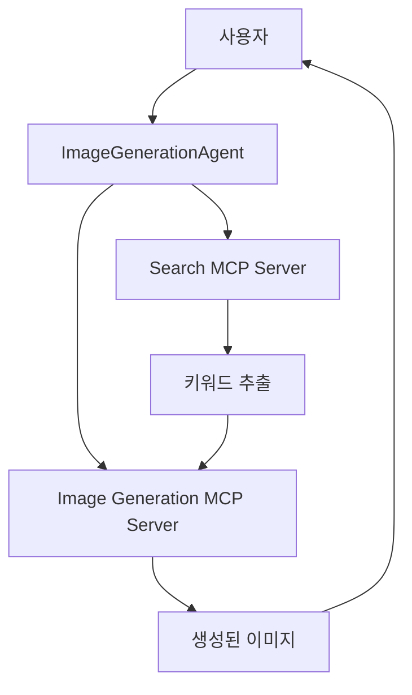

# 이미지 생성 Agent 구축 튜토리얼

## 개요

이 튜토리얼은 사용자가 입력한 텍스트를 기반으로 이미지를 생성하고, 검색 MCP 서버를 통해 적절한 키워드를 추출하는 Agent 시스템을 구축하는 방법을 안내합니다.

## 시스템 아키텍처



## 주요 기능

1. **텍스트 입력 처리**: 사용자로부터 이미지 생성을 위한 텍스트 프롬프트 수신
2. **키워드 추출**: Search MCP Server를 통해 텍스트에서 핵심 키워드 추출
3. **이미지 생성**: 추출된 키워드를 활용하여 고품질 이미지 생성
4. **결과 반환**: 생성된 이미지와 메타데이터를 사용자에게 전달

## 기술 스택

### 핵심 프레임워크 (최신 버전)

- **Python**: 3.12+
- **LangGraph**: 0.6.4 - 상태 기반 워크플로우 관리
- **LangChain**: 0.3.27 - LLM 통합 및 체인 관리
- **langchain-mcp-adapters**: 0.1.9 - MCP 서버 통합
- **FastMCP**: 2.11.3 - MCP 서버 프레임워크
- **A2A SDK**: 0.3.0 - Agent-to-Agent 통신 (선택사항)

### 이미지 생성 라이브러리

- **OpenAI**: DALL-E 3 API
- 또는 **Stability AI**: Stable Diffusion API
- 또는 **Replicate**: 다양한 오픈소스 모델

### 검색 및 키워드 추출

- **Tavily Search API**: 웹 검색 및 컨텍스트 분석
- **OpenAI GPT-4**: 키워드 추출 및 프롬프트 최적화

## 프로젝트 구조

```
tutorials/image-generation-agent/
├── README.md                          # 이 파일
├── requirements.txt                   # Python 의존성
├── .env.example                       # 환경변수 템플릿
├── src/
│   ├── __init__.py
│   ├── image_agent/
│   │   ├── __init__.py
│   │   ├── agent.py                  # LangGraph Agent 구현
│   │   ├── state.py                  # State 정의
│   │   └── nodes.py                  # 워크플로우 노드
│   ├── mcp_servers/
│   │   ├── __init__.py
│   │   ├── search_server.py          # Search MCP Server
│   │   └── image_server.py           # Image Generation MCP Server
│   └── config/
│       ├── __init__.py
│       └── settings.py               # 설정 관리
├── examples/
│   ├── basic_usage.py                # 기본 사용 예제
│   ├── advanced_usage.py             # 고급 사용 예제
│   └── a2a_integration.py            # A2A 통합 예제
└── tests/
    ├── __init__.py
    ├── test_agent.py
    └── test_mcp_servers.py
```

## 단계별 구축 가이드

### 방법 1: Docker 사용 (권장)

Docker를 사용하면 모든 서비스를 컨테이너로 실행하여 환경 설정을 간소화할 수 있습니다.

#### 1.1 사전 요구사항

- Docker Desktop 또는 Docker Engine + Docker Compose 설치
- 16GB 이상 RAM 권장
- 10GB 이상 디스크 여유 공간

#### 1.2 빠른 시작

```bash
# 1. 프로젝트 클론 또는 다운로드
cd tutorials/image-generation-agent

# 2. 환경변수 설정
cp .env.example .env
# .env 파일을 편집하여 API 키 설정
# 필수: OPENAI_API_KEY, TAVILY_API_KEY

# 3. 전체 시스템 시작 (첫 실행시 빌드)
./scripts/start-all.sh build

# 또는 기존 이미지로 시작
./scripts/start-all.sh
```

#### 1.3 Docker 서비스 구성

시스템은 3개의 컨테이너로 구성됩니다:

1. **search-mcp** (Port 8050)
   - Search MCP Server
   - 키워드 추출 및 검색 기능

2. **image-mcp** (Port 8051)
   - Image Generation MCP Server
   - DALL-E 3 이미지 생성

3. **image-agent** (Port 8080)
   - LangGraph Agent
   - A2A 프로토콜 지원

#### 1.4 Docker 관리 명령어

```bash
# 로그 확인
./scripts/logs.sh                    # 모든 서비스 로그
./scripts/logs.sh search-mcp         # 특정 서비스 로그

# 예제 실행
./scripts/run-example.sh basic       # 기본 예제
./scripts/run-example.sh advanced    # 고급 예제

# 서비스 중지
./scripts/stop-all.sh                # 중지
./scripts/stop-all.sh clean          # 중지 + 데이터 정리

# 개별 서비스 재시작
docker-compose restart search-mcp
docker-compose restart image-mcp
docker-compose restart image-agent

# 서비스 상태 확인
docker-compose ps
```

#### 1.5 Docker Compose 구조

`docker-compose.yml` 파일은 다음과 같이 구성됩니다:

```yaml
services:
  search-mcp:      # Search MCP Server
  image-mcp:       # Image Generation MCP Server
  image-agent:     # LangGraph Agent with A2A

networks:
  image-gen-network:  # 내부 네트워크

volumes:
  agent-data:      # 영구 데이터 저장
  agent-logs:      # 로그 저장
```

---

### 방법 2: 로컬 환경 설정

Docker 없이 로컬 Python 환경에서 직접 실행하는 방법입니다.

#### 2.1 프로젝트 초기화

```bash
# 프로젝트 디렉토리 생성
mkdir image-generation-agent
cd image-generation-agent

# 가상환경 생성 및 활성화
python -m venv .venv
source .venv/bin/activate  # Windows: .venv\Scripts\activate

# 의존성 설치
pip install -r requirements.txt
```

#### 2.2 requirements.txt

```txt
# 핵심 프레임워크
langgraph==0.6.4
langchain==0.3.27
langchain-openai==0.3.30
langchain-mcp-adapters==0.1.9
fastmcp==2.11.3

# 유틸리티
python-dotenv==1.0.0
pydantic==2.0.0
pydantic-settings==2.0.0
structlog==25.4.0

# 이미지 생성
openai>=1.0.0
pillow>=10.0.0

# 검색
tavily-python>=0.3.0

# HTTP 클라이언트
httpx>=0.28.1
aiohttp>=3.9.0

# 개발 도구
pytest>=7.0.0
pytest-asyncio>=0.21.0
ruff>=0.1.0
```

#### 2.3 환경변수 설정

`.env` 파일 생성:

```env
# LLM API Keys
OPENAI_API_KEY=your_openai_api_key_here

# 이미지 생성 API
OPENAI_IMAGE_MODEL=dall-e-3

# 검색 API
TAVILY_API_KEY=your_tavily_api_key_here

# 선택적: A2A 프로토콜 사용시
A2A_AGENT_NAME=ImageGenerationAgent
A2A_AGENT_PORT=8080

# 디버그 모드
DEBUG=true
```

#### 2.4 로컬 실행 (MCP 서버)

```bash
# 터미널 1: Search MCP Server 실행
python src/mcp_servers/search_server.py

# 터미널 2: Image Generation MCP Server 실행
python src/mcp_servers/image_server.py

# 터미널 3: 예제 실행
python examples/basic_usage.py
```

---

### 3단계: State 정의

`src/image_agent/state.py`:

```python
"""이미지 생성 Agent의 State 정의"""
from typing import TypedDict, Annotated, Literal
from langgraph.graph import add_messages
from langchain_core.messages import BaseMessage


class ImageGenerationState(TypedDict):
    """이미지 생성 Agent의 상태 스키마

    Attributes:
        messages: 대화 메시지 히스토리
        user_prompt: 사용자가 입력한 원본 텍스트
        extracted_keywords: Search MCP로부터 추출된 키워드 리스트
        optimized_prompt: 이미지 생성을 위해 최적화된 프롬프트
        generated_image_url: 생성된 이미지의 URL
        image_metadata: 이미지 메타데이터 (크기, 형식 등)
        status: 현재 작업 상태
        error: 에러 메시지 (있을 경우)
    """
    # LangGraph 메시지 관리
    messages: Annotated[list[BaseMessage], add_messages]

    # 입력 데이터
    user_prompt: str

    # 중간 처리 데이터
    extracted_keywords: list[str]
    optimized_prompt: str

    # 출력 데이터
    generated_image_url: str | None
    image_metadata: dict | None

    # 상태 관리
    status: Literal["pending", "extracting", "generating", "completed", "failed"]
    error: str | None


class ImageGenerationInput(TypedDict):
    """Agent 입력 스키마"""
    messages: list[dict]


class ImageGenerationOutput(TypedDict):
    """Agent 출력 스키마"""
    messages: list[BaseMessage]
    generated_image_url: str | None
    image_metadata: dict | None
    status: str
```

---

### 3단계: MCP Server 구현

#### 3.1 Search MCP Server

`src/mcp_servers/search_server.py`:

```python
"""Search MCP Server - 키워드 추출 및 컨텍스트 검색"""
import os
from typing import Any

import structlog
from fastmcp import FastMCP
from tavily import TavilyClient
from langchain_openai import ChatOpenAI

logger = structlog.get_logger(__name__)

# FastMCP 서버 초기화
mcp = FastMCP("SearchMCP")

# Tavily 클라이언트 초기화
tavily_client = TavilyClient(api_key=os.getenv("TAVILY_API_KEY"))

# LLM 초기화 (키워드 추출용)
llm = ChatOpenAI(
    model="gpt-4o-mini",
    temperature=0.3
)


@mcp.tool()
async def extract_keywords(user_prompt: str, max_keywords: int = 5) -> dict[str, Any]:
    """사용자 프롬프트에서 이미지 생성에 적합한 키워드 추출

    Args:
        user_prompt: 사용자가 입력한 텍스트
        max_keywords: 추출할 최대 키워드 수 (기본값: 5)

    Returns:
        dict: 추출된 키워드와 메타데이터
            - keywords: 추출된 키워드 리스트
            - categories: 키워드 카테고리 (주제, 스타일, 색상 등)
            - confidence: 추출 신뢰도 (0.0 ~ 1.0)
    """
    try:
        logger.info(f"Extracting keywords from prompt: {user_prompt[:100]}...")

        # LLM을 사용한 키워드 추출
        extraction_prompt = f"""
다음 텍스트에서 이미지 생성에 가장 중요한 키워드를 {max_keywords}개 추출하세요.
각 키워드는 시각적 요소, 분위기, 스타일, 색상, 구도 등을 포함해야 합니다.

텍스트: {user_prompt}

응답 형식 (JSON):
{{
    "keywords": ["키워드1", "키워드2", ...],
    "categories": {{
        "subject": ["주요 대상"],
        "style": ["예술 스타일"],
        "mood": ["분위기"],
        "colors": ["색상"]
    }},
    "confidence": 0.95
}}
"""

        response = await llm.ainvoke(extraction_prompt)

        # JSON 파싱
        import json
        result = json.loads(response.content)

        logger.info(f"Extracted {len(result['keywords'])} keywords")
        return result

    except Exception as e:
        logger.error(f"Keyword extraction failed: {e}")
        return {
            "keywords": [user_prompt],
            "categories": {},
            "confidence": 0.5,
            "error": str(e)
        }


@mcp.tool()
async def search_visual_references(keywords: list[str], max_results: int = 3) -> dict[str, Any]:
    """키워드를 기반으로 시각적 참조 자료 검색

    Args:
        keywords: 검색할 키워드 리스트
        max_results: 최대 검색 결과 수

    Returns:
        dict: 검색 결과
            - references: 참조 이미지 URL 및 설명
            - context: 추가 컨텍스트 정보
    """
    try:
        query = " ".join(keywords)
        logger.info(f"Searching visual references for: {query}")

        # Tavily로 이미지 관련 검색
        search_results = tavily_client.search(
            query=f"{query} image visual reference",
            max_results=max_results,
            search_depth="advanced",
            include_images=True
        )

        references = []
        for result in search_results.get("results", []):
            references.append({
                "title": result.get("title"),
                "url": result.get("url"),
                "content": result.get("content", "")[:200],
            })

        return {
            "references": references,
            "query": query,
            "total_results": len(references)
        }

    except Exception as e:
        logger.error(f"Visual reference search failed: {e}")
        return {
            "references": [],
            "query": " ".join(keywords),
            "error": str(e)
        }


if __name__ == "__main__":
    # MCP 서버 실행
    mcp.run(transport="streamable_http", port=8050)
```

#### 3.2 Image Generation MCP Server

`src/mcp_servers/image_server.py`:

```python
"""Image Generation MCP Server - DALL-E 3 기반 이미지 생성"""
import os
from typing import Any, Literal

import structlog
from fastmcp import FastMCP
from openai import AsyncOpenAI

logger = structlog.get_logger(__name__)

# FastMCP 서버 초기화
mcp = FastMCP("ImageGenerationMCP")

# OpenAI 클라이언트 초기화
openai_client = AsyncOpenAI(api_key=os.getenv("OPENAI_API_KEY"))


@mcp.tool()
async def generate_image(
    prompt: str,
    size: Literal["1024x1024", "1792x1024", "1024x1792"] = "1024x1024",
    quality: Literal["standard", "hd"] = "standard",
    style: Literal["vivid", "natural"] = "vivid"
) -> dict[str, Any]:
    """DALL-E 3를 사용하여 이미지 생성

    Args:
        prompt: 이미지 생성 프롬프트
        size: 이미지 크기 (1024x1024, 1792x1024, 1024x1792)
        quality: 이미지 품질 (standard, hd)
        style: 이미지 스타일 (vivid, natural)

    Returns:
        dict: 생성된 이미지 정보
            - url: 이미지 URL
            - revised_prompt: DALL-E가 수정한 프롬프트
            - metadata: 이미지 메타데이터
    """
    try:
        logger.info(f"Generating image with prompt: {prompt[:100]}...")
        logger.info(f"Settings - size: {size}, quality: {quality}, style: {style}")

        # DALL-E 3 API 호출
        response = await openai_client.images.generate(
            model="dall-e-3",
            prompt=prompt,
            size=size,
            quality=quality,
            style=style,
            n=1
        )

        image_data = response.data[0]

        result = {
            "url": image_data.url,
            "revised_prompt": image_data.revised_prompt,
            "metadata": {
                "model": "dall-e-3",
                "size": size,
                "quality": quality,
                "style": style,
                "original_prompt": prompt
            }
        }

        logger.info(f"Image generated successfully: {result['url']}")
        return result

    except Exception as e:
        logger.error(f"Image generation failed: {e}")
        return {
            "url": None,
            "error": str(e),
            "metadata": {
                "model": "dall-e-3",
                "size": size,
                "quality": quality,
                "style": style
            }
        }


@mcp.tool()
async def optimize_prompt_for_image(
    base_prompt: str,
    keywords: list[str],
    style_preferences: dict | None = None
) -> dict[str, Any]:
    """이미지 생성을 위한 프롬프트 최적화

    Args:
        base_prompt: 기본 프롬프트
        keywords: 추출된 키워드
        style_preferences: 스타일 선호도 (선택사항)

    Returns:
        dict: 최적화된 프롬프트
            - optimized_prompt: 최적화된 프롬프트
            - enhancements: 추가된 개선사항
    """
    try:
        # 키워드 통합
        keywords_str = ", ".join(keywords)

        # 스타일 설정 적용
        style_additions = []
        if style_preferences:
            if "art_style" in style_preferences:
                style_additions.append(f"{style_preferences['art_style']} style")
            if "mood" in style_preferences:
                style_additions.append(f"{style_preferences['mood']} mood")
            if "lighting" in style_preferences:
                style_additions.append(f"{style_preferences['lighting']} lighting")

        # 최적화된 프롬프트 구성
        components = [base_prompt, keywords_str] + style_additions
        optimized_prompt = ", ".join(filter(None, components))

        # 품질 향상 접미사 추가
        quality_suffix = "high quality, detailed, professional"
        final_prompt = f"{optimized_prompt}, {quality_suffix}"

        logger.info(f"Optimized prompt: {final_prompt}")

        return {
            "optimized_prompt": final_prompt,
            "enhancements": {
                "keywords_added": len(keywords),
                "style_additions": style_additions,
                "quality_enhancements": quality_suffix
            }
        }

    except Exception as e:
        logger.error(f"Prompt optimization failed: {e}")
        return {
            "optimized_prompt": base_prompt,
            "error": str(e)
        }


if __name__ == "__main__":
    # MCP 서버 실행
    mcp.run(transport="streamable_http", port=8051)
```

---

### 4단계: LangGraph Agent 구현

#### 4.1 워크플로우 노드

`src/image_agent/nodes.py`:

```python
"""이미지 생성 Agent의 워크플로우 노드 구현"""
import structlog
from langchain_core.messages import HumanMessage, AIMessage

from .state import ImageGenerationState

logger = structlog.get_logger(__name__)


async def extract_keywords_node(
    state: ImageGenerationState,
    search_tools: list
) -> ImageGenerationState:
    """키워드 추출 노드

    Search MCP의 extract_keywords 도구를 사용하여
    사용자 프롬프트에서 핵심 키워드를 추출합니다.
    """
    try:
        logger.info("Extracting keywords from user prompt")

        user_prompt = state["user_prompt"]

        # Search MCP 도구 찾기
        extract_tool = next(
            (tool for tool in search_tools if tool.name == "extract_keywords"),
            None
        )

        if not extract_tool:
            raise ValueError("extract_keywords tool not found")

        # 키워드 추출 실행
        result = await extract_tool.ainvoke({"user_prompt": user_prompt})

        keywords = result.get("keywords", [])
        confidence = result.get("confidence", 0.0)

        logger.info(f"Extracted {len(keywords)} keywords with confidence {confidence}")

        # 메시지 추가
        state["messages"].append(
            AIMessage(content=f"키워드 추출 완료: {', '.join(keywords)}")
        )

        return {
            **state,
            "extracted_keywords": keywords,
            "status": "extracting"
        }

    except Exception as e:
        logger.error(f"Keyword extraction node failed: {e}")
        return {
            **state,
            "status": "failed",
            "error": str(e)
        }


async def optimize_prompt_node(
    state: ImageGenerationState,
    image_tools: list
) -> ImageGenerationState:
    """프롬프트 최적화 노드

    Image Generation MCP의 optimize_prompt_for_image 도구를 사용하여
    이미지 생성을 위한 프롬프트를 최적화합니다.
    """
    try:
        logger.info("Optimizing prompt for image generation")

        user_prompt = state["user_prompt"]
        keywords = state["extracted_keywords"]

        # Image MCP 도구 찾기
        optimize_tool = next(
            (tool for tool in image_tools if tool.name == "optimize_prompt_for_image"),
            None
        )

        if not optimize_tool:
            raise ValueError("optimize_prompt_for_image tool not found")

        # 프롬프트 최적화 실행
        result = await optimize_tool.ainvoke({
            "base_prompt": user_prompt,
            "keywords": keywords
        })

        optimized_prompt = result.get("optimized_prompt", user_prompt)

        logger.info(f"Optimized prompt: {optimized_prompt[:100]}...")

        # 메시지 추가
        state["messages"].append(
            AIMessage(content=f"프롬프트 최적화 완료")
        )

        return {
            **state,
            "optimized_prompt": optimized_prompt,
            "status": "generating"
        }

    except Exception as e:
        logger.error(f"Prompt optimization node failed: {e}")
        return {
            **state,
            "status": "failed",
            "error": str(e)
        }


async def generate_image_node(
    state: ImageGenerationState,
    image_tools: list
) -> ImageGenerationState:
    """이미지 생성 노드

    Image Generation MCP의 generate_image 도구를 사용하여
    최적화된 프롬프트로 이미지를 생성합니다.
    """
    try:
        logger.info("Generating image")

        optimized_prompt = state["optimized_prompt"]

        # Image MCP 도구 찾기
        generate_tool = next(
            (tool for tool in image_tools if tool.name == "generate_image"),
            None
        )

        if not generate_tool:
            raise ValueError("generate_image tool not found")

        # 이미지 생성 실행
        result = await generate_tool.ainvoke({
            "prompt": optimized_prompt,
            "size": "1024x1024",
            "quality": "standard",
            "style": "vivid"
        })

        image_url = result.get("url")
        metadata = result.get("metadata", {})

        if not image_url:
            raise ValueError(f"Image generation failed: {result.get('error')}")

        logger.info(f"Image generated successfully: {image_url}")

        # 메시지 추가
        state["messages"].append(
            AIMessage(
                content=f"이미지 생성 완료!\n이미지 URL: {image_url}"
            )
        )

        return {
            **state,
            "generated_image_url": image_url,
            "image_metadata": metadata,
            "status": "completed"
        }

    except Exception as e:
        logger.error(f"Image generation node failed: {e}")
        return {
            **state,
            "status": "failed",
            "error": str(e)
        }
```

#### 4.2 Agent 메인 클래스

`src/image_agent/agent.py`:

```python
"""이미지 생성 LangGraph Agent"""
import structlog
from langchain_core.messages import HumanMessage
from langgraph.graph import StateGraph, END
from langgraph.checkpoint.memory import MemorySaver

from .state import ImageGenerationState, ImageGenerationInput, ImageGenerationOutput
from .nodes import extract_keywords_node, optimize_prompt_node, generate_image_node

logger = structlog.get_logger(__name__)


class ImageGenerationAgent:
    """이미지 생성 Agent

    LangGraph를 사용하여 구현된 이미지 생성 워크플로우:
    1. 사용자 입력 수신
    2. 키워드 추출 (Search MCP)
    3. 프롬프트 최적화 (Image MCP)
    4. 이미지 생성 (Image MCP)
    """

    def __init__(
        self,
        search_tools: list,
        image_tools: list,
        checkpointer: MemorySaver | None = None
    ):
        """Agent 초기화

        Args:
            search_tools: Search MCP 서버의 도구 리스트
            image_tools: Image Generation MCP 서버의 도구 리스트
            checkpointer: 체크포인터 (선택사항)
        """
        self.search_tools = search_tools
        self.image_tools = image_tools
        self.checkpointer = checkpointer or MemorySaver()

        # 그래프 빌드
        self.graph = self._build_graph()

        logger.info("ImageGenerationAgent initialized")

    def _build_graph(self):
        """LangGraph 워크플로우 구축"""

        # StateGraph 생성
        workflow = StateGraph(
            state_schema=ImageGenerationState,
            input=ImageGenerationInput,
            output=ImageGenerationOutput
        )

        # 노드 추가
        workflow.add_node(
            "extract_keywords",
            lambda state: extract_keywords_node(state, self.search_tools)
        )
        workflow.add_node(
            "optimize_prompt",
            lambda state: optimize_prompt_node(state, self.image_tools)
        )
        workflow.add_node(
            "generate_image",
            lambda state: generate_image_node(state, self.image_tools)
        )

        # 엣지 정의
        workflow.set_entry_point("extract_keywords")
        workflow.add_edge("extract_keywords", "optimize_prompt")
        workflow.add_edge("optimize_prompt", "generate_image")
        workflow.add_edge("generate_image", END)

        # 컴파일
        return workflow.compile(
            checkpointer=self.checkpointer,
            debug=True
        )

    async def generate(
        self,
        user_prompt: str,
        thread_id: str = "default"
    ) -> dict:
        """이미지 생성 실행

        Args:
            user_prompt: 사용자 입력 텍스트
            thread_id: 대화 스레드 ID

        Returns:
            dict: 생성 결과
                - generated_image_url: 이미지 URL
                - image_metadata: 메타데이터
                - status: 상태
        """
        try:
            logger.info(f"Starting image generation for prompt: {user_prompt[:100]}...")

            # 초기 상태 구성
            initial_state = {
                "messages": [HumanMessage(content=user_prompt)],
                "user_prompt": user_prompt,
                "extracted_keywords": [],
                "optimized_prompt": "",
                "generated_image_url": None,
                "image_metadata": None,
                "status": "pending",
                "error": None
            }

            # 그래프 실행
            config = {"configurable": {"thread_id": thread_id}}
            result = await self.graph.ainvoke(initial_state, config)

            logger.info(f"Image generation completed with status: {result['status']}")

            return {
                "generated_image_url": result.get("generated_image_url"),
                "image_metadata": result.get("image_metadata"),
                "extracted_keywords": result.get("extracted_keywords"),
                "optimized_prompt": result.get("optimized_prompt"),
                "status": result["status"],
                "error": result.get("error")
            }

        except Exception as e:
            logger.error(f"Image generation failed: {e}")
            return {
                "generated_image_url": None,
                "image_metadata": None,
                "status": "failed",
                "error": str(e)
            }
```

---

### 5단계: 실행 및 테스트

#### 5.1 Docker 환경에서 실행

```bash
# 1. 전체 시스템 시작
./scripts/start-all.sh build

# 2. 기본 예제 실행
./scripts/run-example.sh basic

# 3. 고급 예제 실행
./scripts/run-example.sh advanced

# 4. 로그 확인
./scripts/logs.sh                    # 모든 서비스
./scripts/logs.sh image-agent        # Agent만
```

#### 5.2 로컬 환경에서 실행

```bash
# 터미널 1: Search MCP Server
python src/mcp_servers/search_server.py

# 터미널 2: Image Generation MCP Server
python src/mcp_servers/image_server.py

# 터미널 3: 예제 실행
python examples/basic_usage.py
```

---

### 6단계: 사용 예제

#### 6.1 기본 사용 예제

`examples/basic_usage.py`:

```python
"""기본 사용 예제"""
import asyncio
import os
from dotenv import load_dotenv

# 환경변수 로드
load_dotenv()

async def main():
    """기본 이미지 생성 예제"""

    # 1. MCP 서버에서 도구 로드
    from langchain_mcp_adapters.client import MultiServerMCPClient

    mcp_servers = {
        "search": {
            "transport": "streamable_http",
            "url": "http://localhost:8050/mcp"
        },
        "image": {
            "transport": "streamable_http",
            "url": "http://localhost:8051/mcp"
        }
    }

    print("Connecting to MCP servers...")
    mcp_client = MultiServerMCPClient(mcp_servers)
    tools = await mcp_client.get_tools()

    # 도구 분류
    search_tools = [t for t in tools if "search" in t.name or "keyword" in t.name]
    image_tools = [t for t in tools if "image" in t.name or "prompt" in t.name]

    print(f"Loaded {len(search_tools)} search tools and {len(image_tools)} image tools")

    # 2. Agent 생성
    from src.image_agent.agent import ImageGenerationAgent

    agent = ImageGenerationAgent(
        search_tools=search_tools,
        image_tools=image_tools
    )

    # 3. 이미지 생성
    user_prompt = "석양이 지는 바닷가에서 서핑을 즐기는 사람들"

    print(f"\n사용자 입력: {user_prompt}")
    print("이미지 생성 중...")

    result = await agent.generate(user_prompt)

    # 4. 결과 출력
    print("\n=== 생성 결과 ===")
    print(f"상태: {result['status']}")

    if result['status'] == 'completed':
        print(f"추출된 키워드: {', '.join(result['extracted_keywords'])}")
        print(f"최적화된 프롬프트: {result['optimized_prompt']}")
        print(f"이미지 URL: {result['generated_image_url']}")
        print(f"메타데이터: {result['image_metadata']}")
    else:
        print(f"에러: {result.get('error')}")


if __name__ == "__main__":
    asyncio.run(main())
```

#### 6.2 예상 출력

```
Connecting to MCP servers...
Loaded 2 search tools and 2 image tools

사용자 입력: 석양이 지는 바닷가에서 서핑을 즐기는 사람들
이미지 생성 중...

=== 생성 결과 ===
상태: completed
추출된 키워드: 석양, 바닷가, 서핑, 사람들, 황금빛
최적화된 프롬프트: 석양이 지는 바닷가에서 서핑을 즐기는 사람들, 석양, 바닷가, 서핑, 사람들, 황금빛, high quality, detailed, professional
이미지 URL: https://oaidalleapiprodscus.blob.core.windows.net/private/...
메타데이터: {'model': 'dall-e-3', 'size': '1024x1024', 'quality': 'standard', 'style': 'vivid'}
```

---

## 다음 단계

### A2A 프로토콜 통합

A2A SDK를 사용하여 Agent를 외부 시스템과 통합하는 방법은 `examples/a2a_integration.py`를 참조하세요.

### 고급 기능 추가

1. **다중 이미지 생성**: 여러 스타일의 이미지를 동시에 생성
2. **이미지 편집**: 생성된 이미지를 추가로 수정
3. **스타일 프리셋**: 미리 정의된 스타일 템플릿 사용
4. **배치 처리**: 여러 프롬프트를 한 번에 처리

### 성능 최적화

1. **캐싱**: 동일한 키워드에 대한 결과 캐싱
2. **병렬 처리**: 여러 단계를 병렬로 실행
3. **비동기 스트리밍**: 중간 결과를 스트리밍으로 전달

---

## 문제 해결

### 일반적인 오류

#### 1. MCP 서버 연결 실패
```
ConnectionError: Failed to connect to MCP server
```
**해결방법**: MCP 서버가 실행 중인지 확인하고, 포트가 올바른지 확인하세요.

#### 2. API 키 오류
```
AuthenticationError: Invalid API key
```
**해결방법**: `.env` 파일에 올바른 API 키가 설정되어 있는지 확인하세요.

#### 3. 이미지 생성 실패
```
ImageGenerationError: Content policy violation
```
**해결방법**: 프롬프트가 OpenAI의 콘텐츠 정책을 위반하지 않는지 확인하세요.

---

## 참고 자료

- [LangGraph 공식 문서](https://langchain-ai.github.io/langgraph/)
- [FastMCP 문서](https://github.com/jlowin/fastmcp)
- [OpenAI DALL-E API](https://platform.openai.com/docs/guides/images)
- [Tavily Search API](https://tavily.com)
- [A2A Protocol](https://github.com/anthropics/a2a)

---

## 라이센스

MIT License

---

## 기여

이슈와 풀 리퀘스트를 환영합니다!
